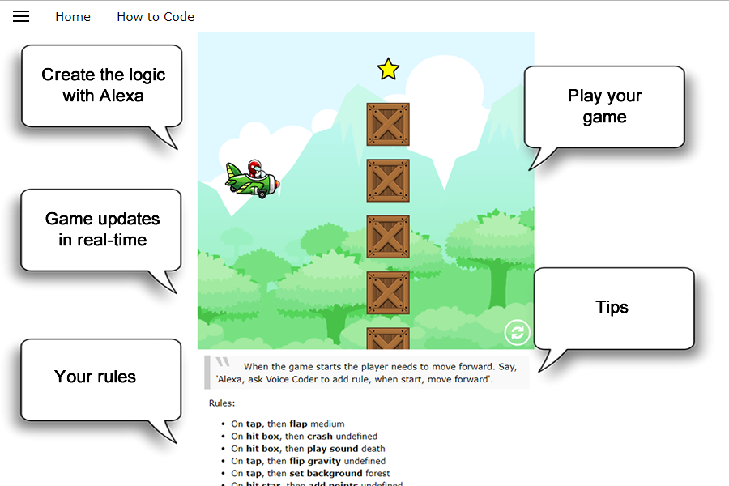
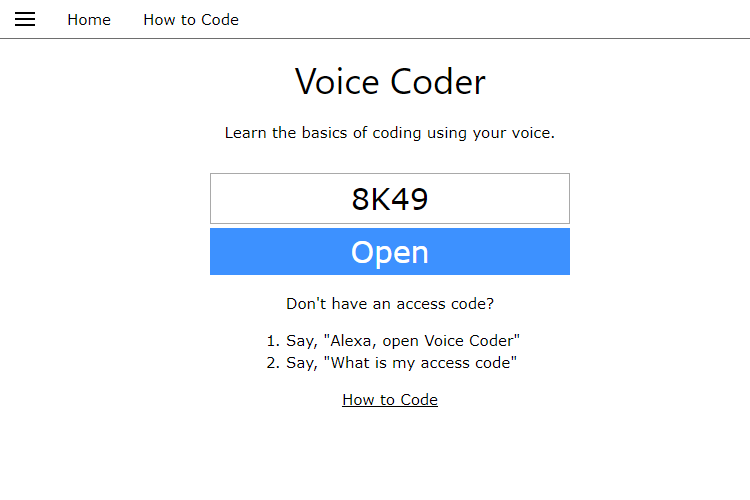

# Voice Coder

## Alexa Skill

Voice Coder helps you learn about coding while creating your own game with your voice.

To get started. Say, "Alexa open Voice Coder"

https://voicecode.net

## Inspiration
I'm a coder by trade and have had the opportunity to be a volunteer teacher for programming clubs at grade schools and middle schools. The tools we use to teach need to be exciting and produce quick results. Traditionally programming has an extremely low tolerance for error. One wrong typo and the program crashes. Typing and spelling is even harder for young learners and creates a barrier to coding. By using voice instead of typing, new coders can enjoy creating their own masterpiece(in this case, mini game) while learning the basic of coding. Voice Coder helps you code a mini game using only your voice through Alexa.

## What it does
To get started. Say, "Alexa open Voice Coder"

Voice Coder helps you learn about coding while creating your own game with your voice. The game starts without any logic or rules. Your job is to program rules.

Rules include events, actions, and sometimes values. Events are when something happens. Actions do stuff, like move, play a sound, or give points. You can add a new rule by saying, "add new rule".

Once your game is created, you can play it on your mobile or desktop computer. To play your game, go to, https://voicecoder.net and enter your access code. You can share you created game with other with that same code. Just ask me for your access code.

While playing the game you can add more rules. In fact the game logic will update in real-time. For example, in mid game you can change the gravity and it will update live. The game will suggest more rules to help you along via Alexa and the game itself.

Say "Alexa, open Voice Coder" to get started
Say, "Add rule" to add a rule
Say, "New game" to start a new game.
Say, "List all events", to list all the events.
Say, "Alexa, ask Voice Coder to ..." to skip opening the skill.
Say, "Alexa, ask Voice Coder to add rule when start set background to moon".
How I built it
The project is split into 4 parts: The Logic Creator, Alexa interface, server and the game.

The Logic Creator know nothing of the other parts. Its jobs is to create the dialog based on the game template. This was the first piece built. To test it, a mini command line application was created to interface with it. This is where all the magic happens. All commands are process and passed to a single router function. An internal function is then called based on the command and context from the previous command. The context was key to asking multi part questions that change depending on the previous answer. For example after adding a rule for "on start" it will ask which actions available to that event. Same for values related to actions. All of the available events/action/value hierarchy is saved in the game template. I idea is be able to create many template for many games. For now just one. Coded with node.js and no dependencies.

The Alexa interface using the Logic Creator. The Alexa code's job is to understand the intent coming from the Alexa device. It then passes the commands to the Logic Creator to get a response. The Alexa code saves the state to session and long term to an aws dynamodb table. Coded with ASK SDK v2 for Node.js hosted on aws lambda service.

The server host a web server. Its job is to connect the game and game data(rules). It hosts the game's static files to serve up the game via https://voicecoder.net. It also has 1 API call to read the game data created saved in the DB. The server also host a websocket for live updates. When the Alexa skill saves the game data to the DB, it attempts to push the data to the game client if it is open. This allows for live updates during the game play. The user enters its access code to play the game with their. Coded with node.js and express.

The Game is the web based game. The game consumes the game data(rules) created by the Logic Creator. The game has matching events that can be triggered. When an event is triggered it check all the rules to see if an action should be executed. The game know what to do with each action, such as set background. The Logic Creator only knew it had an event and action, but not what they do. Coded with javascript and phaser.js.

## Challenges I ran into
Voice Coded needed to ask multiple followup questions. Each follow up question was dependent on the last answer determined by the game template data. The hard part was following the context. To over come this, the game passes a context around using Alexa's session. The context also has to be cleared at times when the play abandoned the current flow.

## Accomplishments that I'm proud of
Live updates via socket gave it instant updates. The live updates are not required or necessary for Voice Coder to work, but once they were working I felt much immersed in the coding flow. This made the process 100% hand free, not having to tap refresh on the game after each command. We will call it the magic glue.

## What I learned
The conversation flow needs to feel natural and keep you going. At first the dialog was very technical and verbose giving every option for every item. It was information overload. Without it, the flow was rigid and user didn't know what to do. After the options were minimized to just a few suggestions, the flow started to get better. The key to keeping the flow was tips. They are smart tips. The first few tips pre-answer 2 of the 3 part question making it into a single question. They even allowed custom dialog for the cases the automated generated ones were not clear. Later they are more open to allow more freedom as the user progressed.

## What's next for Voice Coder
More games. Voice Coder is designed to support many games templates. I would like to add more game templates with more mini games. I had few game on the "to do" list, but only one made it. I would also like to add more options (Event\Actions\Values) to the game. I want the user to free like they can do anything they can think of, at least almost.

## Built With
- javascript
- node.js
- phaser.js
- html
- amazon-web-services
- azure
- alexa
- lambda
- vs-code
- express.js

## Try it out
 https://voicecoder.net